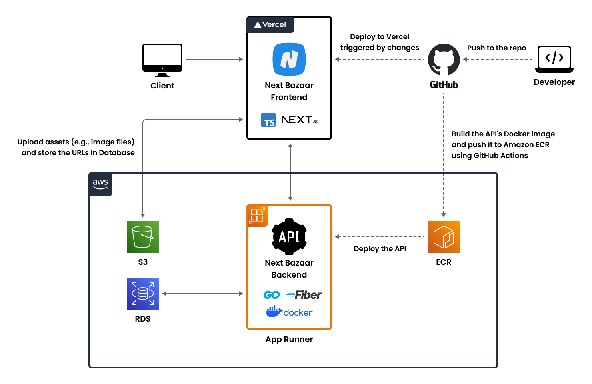

# Next Bazaar

A shopping website using Next.js and Go, designed to learn web development techniques.

## Deployment Links

- [Website](https://next-bazaar.vercel.app/)
- [Storybook](https://main--65224f832ec3028e25f863e1.chromatic.com/)
- [Swagger](https://yeuh7wr9ys.ap-northeast-1.awsapprunner.com/swagger/index.html)

## Technology Stack

| Category | Technologies                                                                                      |
| -------- | ------------------------------------------------------------------------------------------------- |
| Frontend | TypeScript, React, Next.js(pages directory), Tanstack Query, Mantine, React Hook Form, Zod, Orval |
| Backend  | Go, Fiber, sqlc                                                                                   |
| Database | Amazon RDS (PostgreSQL)                                                                           |
| Storage  | AWS S3                                                                                            |
| Deploy   | Vercel, AWS App Runner, Amazon ECR, Docker                                                        |
| CI/CD    | GitHub Actions                                                                                    |
| Others   | Storybook, Chromatic, ESLint, Prettier, Jest, React Testing Library, Mock Service Worker, Swagger |

## System Architecture

